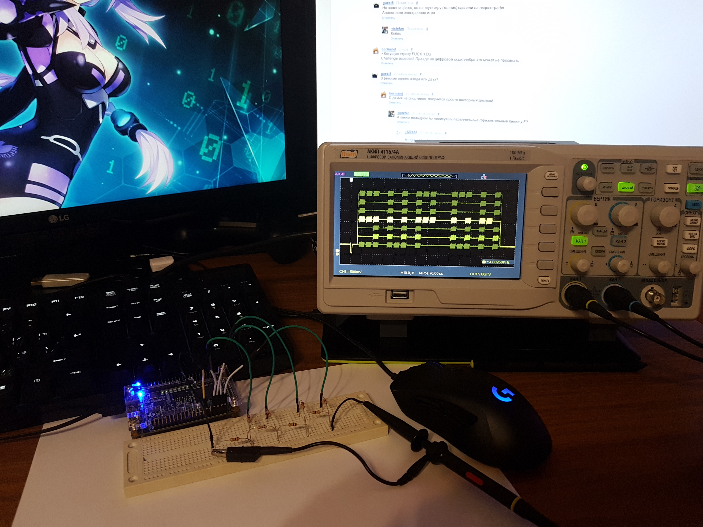
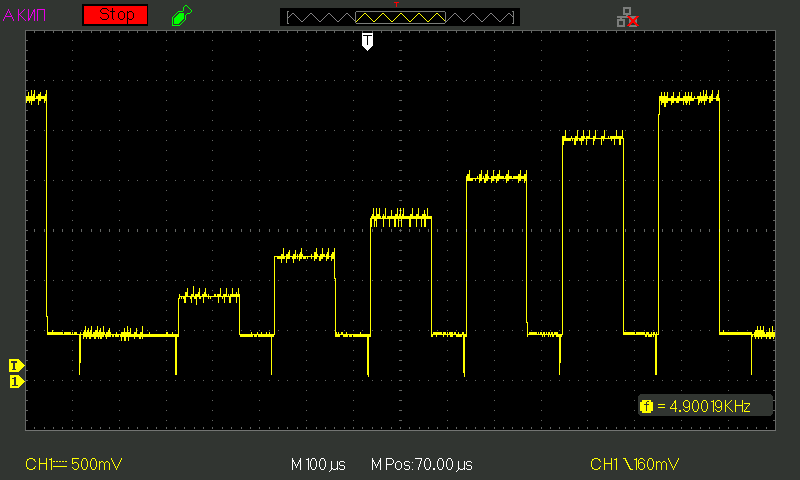

Drawing pixels on the oscilloscope
===================================================



```verilog
module scope_test(
    input wire clk_50,
    output reg[3:0] dac
);


reg[3:0] d, next_d;
reg[9:0] x, next_x;
reg[2:0] y, next_y;
reg[9:0] px;

reg[6:0] pixels[0:31];
initial $readmemb("pixels.txt", pixels);

always @(*) begin
    next_d = d - 1;
    next_x = x;
    next_y = y;
    if (d == 0) begin
        next_d = 9;
        next_x = x + 1;
        if (x == 1023)
            next_y = y < 6 ? y + 1 : 0;
    end

    px = x - 36;

    if (x < 8) begin
        dac = 0;
    end else if (x < 32) begin
        dac = 2;
    end else if (x < 680) begin
        if (((px & 31) >= 4) && ((px & 31) < 28) && (pixels[px >> 5] & (1 << y)))
            dac = 1 + y * 2 + (x & 1) * 2;
        else
            dac = 2 + y * 2;
    end else begin
        dac = 2;
    end
end

always @(posedge clk_50) begin
    d <= next_d;
    x <= next_x;
    y <= next_y;
end

endmodule
```

Output from the `dac` pins converted by simple 4-bit R-2R DAC.

True waveform of the signal:


