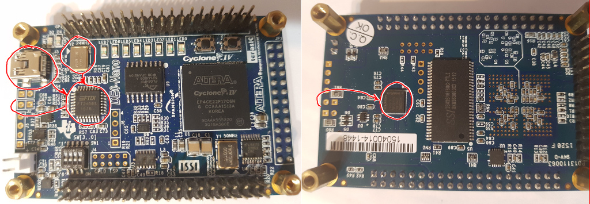
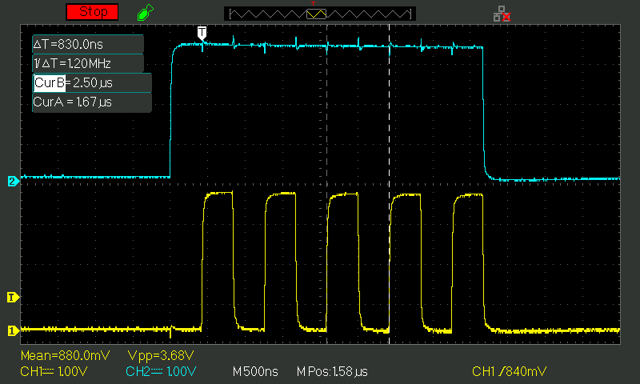
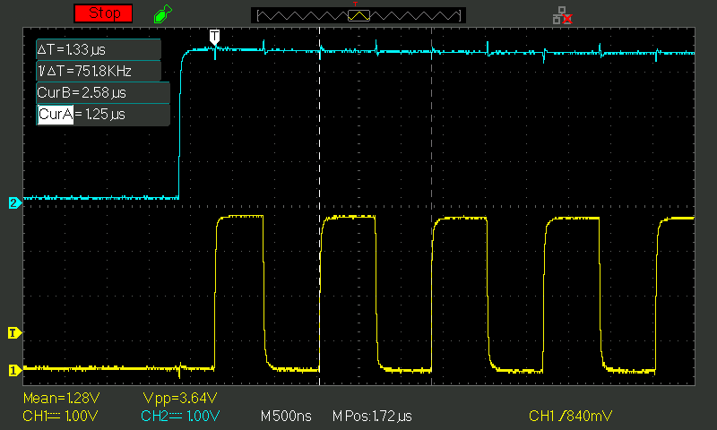
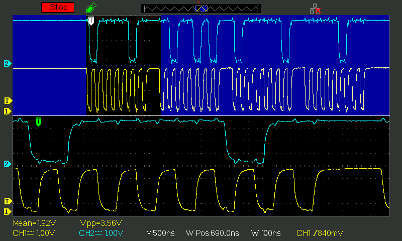
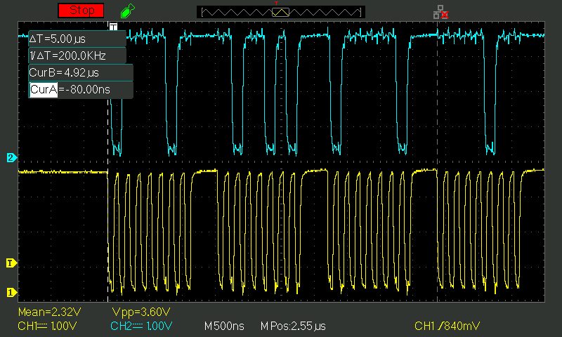

Taming the Slowpoke or fast JTAG link with DE0-Nano
===================================================

## Intro

Some of my DE0-Nano projects demanded fast and reliable communication with PC.
Of course, Cyclone IV can easily talk with UART, SPI or even USB FS.
But that will require additional hardware (some pins and wires at least).
So, I decided to use the only PC compatible connector — Micro-USB port of the USB-Blaster.
Using same port for both config upload and communication will be convenient too.

Quartus tools support TCL commands for JTAG communication over USB-Blaster.
But that tools aren't very portable (try to run them on latest Linux distros for example).
And installing twelve gigs just to handle 100 JTAG exchanges per second isn't very fun.

OpenOCD has drivers for USB-Blaster.
Unfortunately, their driver can handle at most 250 exchanges per second
(it probably suffers from the small packet problem that will be described below).

So, let's try to communicate with DE0-Nano directly!

## First steps

OpenOCD code contains useful comments and links about USB-Blaster hardware and protocol:
[usb_blaster.c](https://sourceforge.net/p/openocd/code/ci/master/tree/src/jtag/drivers/usb_blaster/usb_blaster.c)

Now it's easy to locate USB-Blaster components on the board: FT245BL and 24MHz oscillator on the front side and EPM240 on the back side.
FT245BL is just a USB to 8-bit parallel converter. EPM240 bridges that converter to the JTAG pins of the FPGA and handles actual protocol.



Basic FT245BL protocol is very simple.
Just send outgoing data with bulk transfer to the endpoint 0x02 and receive incoming data from the endpoint 0x81.
Each incoming packet will be prefixed with two "modem status bytes" that are useless for parallel port and can be dropped.

USB-Blaster protocol (handled by EPM240) is simple too (quote from OpenOCD sources):

```c
/*
 * Actually, the USB-Blaster offers a byte-shift mode to transmit up to 504 data
 * bits (bidirectional) in a single USB packet. A header byte has to be sent as
 * the first byte in a packet with the following meaning:
 *
 *   Bit 7 (0x80): Must be set to indicate byte-shift mode.
 *   Bit 6 (0x40): If set, the USB-Blaster will also read data, not just write.
 *   Bit 5..0:     Define the number N of following bytes
 *
 * All N following bytes will then be clocked out serially on TDI. If Bit 6 was
 * set, it will afterwards return N bytes with TDO data read while clocking out
 * the TDI data. LSB of the first byte after the header byte will appear first
 * on TDI.
 */

/* Simple bit banging mode:
 *
 *   Bit 7 (0x80): Must be zero (see byte-shift mode above)
 *   Bit 6 (0x40): If set, you will receive a byte indicating the state of TDO
 *                 in return.
 *   Bit 5 (0x20): Output Enable/LED.
 *   Bit 4 (0x10): TDI Output.
 *   Bit 3 (0x08): nCS Output (not used in JTAG mode).
 *   Bit 2 (0x04): nCE Output (not used in JTAG mode).
 *   Bit 1 (0x02): TMS Output.
 *   Bit 0 (0x01): TCK Output.
 *
 * For transmitting a single data bit, you need to write two bytes (one for
 * setting up TDI/TMS/TCK=0, and one to trigger TCK high with same TDI/TMS
 * held). Up to 64 bytes can be combined in a single USB packet.
 * It isn't possible to read a data without transmitting data.
 */

```

Both EPM240 and Cyclone have BGA packages. It's hard to monitor signals on their pins unless they are connected to something more accessible.
Quartus library contains undocumented component `cycloneive_jtag`. We can use that component to forward JTAG signals to the external pins:

```verilog
module test(
    input tck,
    input tms,
    input tdi,
    output tdo,
    output tckutap,
    output tmsutap,
    output tdiutap
);
    cycloneive_jtag jtag(
        .tck(tck),
        .tms(tms),
        .tdi(tdi),
        .tdo(tdo),
        .tckutap(tckutap),
        .tmsutap(tmsutap),
        .tdiutap(tdiutap)
    );
endmodule
```

Let's send some bits in bit-bang mode:

```python
# TX only in the bit-bang mode
dev.bulkWrite(0x02, [TMS, TMS|TCK] * 5 + [0])
```



```python
# TX+RX in the bit-bang mode
dev.bulkWrite(0x02, [TMS|READ, TMS|TCK|READ] * 5 + [0])
dev.bulkRead(0x81, 64)
```



Yellow is TCK, blue is TMS. As you can see, bit-banging mode is not very fast.
Single bit transmission consumes 830ns. Receiving bumps that to 1.33µs.
Moreover, we waste two bytes on USB per single JTAG bit (16x overhead!).

Now try byte-shift mode:

```python
# TX only in the byte-shift mode
dev.bulkWrite(0x02, [BYTES|4, 0xDE, 0xAD, 0xBE, 0xEF])
```



Yellow is TCK, blue is TDI. Now transmission is four times faster (168ns per bit, 193ns taking account for gaps between bytes).
Therefore, transmission speed will be capped at 5.18MBit/s.

Note that TDI is switched in the middle between falling and rising edges of the TCK. Why not on the falling edge to give TDI more time to settle?
Probably USB-Blaster designers attempted to simplify shifting by changing TDI and reading TDO at the same time.

Also note that TCK remains high after byte transmission. We should account for that to properly combine bit-banging and byte-shifting code.

```python
# TX+RX in the byte-shift mode
dev.bulkWrite(0x02, [BYTES|READ|4, 0xDE, 0xAD, 0xBE, 0xEF])
dev.bulkRead(0x81, 64)
```



Clock speed during duplex transfer is same, but gaps are larger than for transmission. It gives 208ns/bit with accounting for gaps.
Therefore, duplex speed will be capped at 4.8MBit/s.

TO BE CONTINUED...
